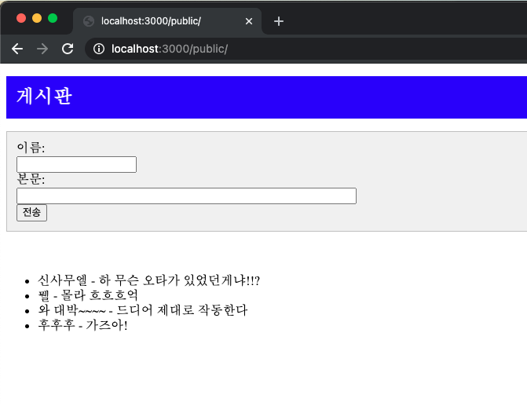

# react + express로 만든 간단한 게시판
이름과 문장 입력만으로 구성되는 매우 간단한 앱

로그 데이터는 NeDB를 사용하여 저장한다. NeDB는 NoSQL DB로 JSON 형식으로 데이터를 저장하는 파일 기반의 간단한 데이터베이스이다.

리액트로 만든 클라이언트는 보통 웹 서버와 통신을 하면서 작동된다. 하지만 리액트는 Ajax(Asynchronous JavaScript XML) 통신 기능을 제공하지 않는다.
그래서 jQuery 같은 별도의 라이브러리가 사용된다. 하지만 jQuery는 DOM 조작 기능도 같이 있는 too much한 라이브러리이기 때문에, 
이 예제코드에서는 웹 서버와의 통신 기능만 제공하는 SuperAgent 모듈을 이용한다.

여기서 쓰이는 웹팩이란 자바스크립트 또는 CSS 등의 리소스 파일을 하나로 합쳐주거나, JSX처럼 특수한 기법으로 작성된 파일을 변환하는 모듈이다.
웹팩을 사용하면 자동으로 자바스크립트 모듈 의존 관계를 해결해줘서 매우 편리하다.
웹팩에는 다양한 플러그인이 제공되는데, Babel 플러그인을 사용하면 최신 표준으로 작성된 자바스크립트도 오래된 브라우저에서 실행할 수 있게 변환해준다.

실행 명령어

$ npm install  
$ npm run build         // 웹팩 모듈을 이용해서 /src/index.js 를 /public/bundle.js 로 변환한다!  
$ npm bbs-server.js  

