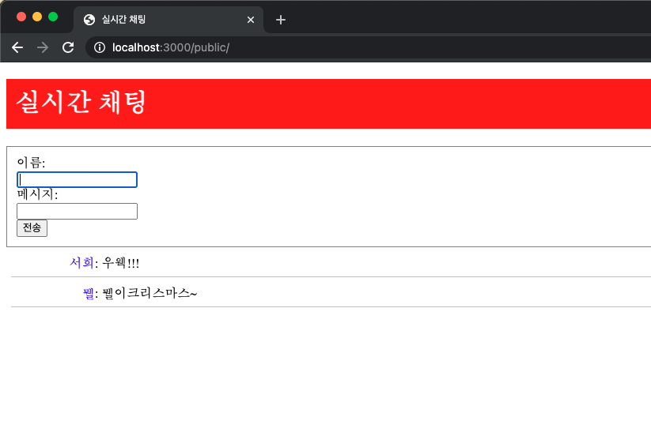

# Socket.IO로 구현하는 간단한 실시간 채팅

HTTP 코드로 클라이언트에서 서버로 데이터를 요청하면 서버는 그에 대한 응답을 할 수 있다. 하지만 서버에서 클라이언트로 먼저 데이터를 전송하려면 웹소켓을 이용해야한다. 
웹 소켓은 서버와 클라이언트 간의 양방향 통신을 위한 기술이다.

HTTP 통신은 "http://xxx"와 암호화된 "https:///xxx"라는 URI 스키마를 사용하지만, 웹 소켓은 "ws://xxx"와 암호화된 "wss://xxx"라는 스키마를 사용한다.
이 예제에서는 웹 소켓을 편리하게 사용할 수 있게 한 Socket.IO라는 모듈을 사용한다.

실행 명령어

$ npm install  
$ npm run build         // 웹팩 모듈을 이용해서 /src/index.js 를 /public/bundle.js 로 변환한다!  
$ npm chat-server.js  

