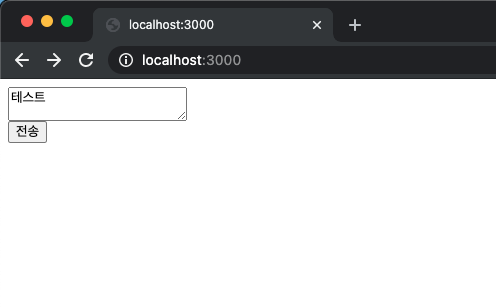
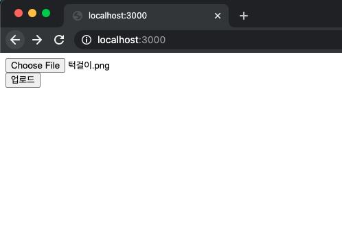
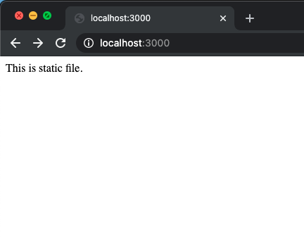

# 완전 간단한 express 실습
express는 Node.js 사용자에게 가장 많이 쓰고 있는 웹 애플리케이션 개발 전용 프레임워크이다.

실행 코드 (node가 설치되어있어야 한다.)
$ npm install
$ node statc.js 또는 $ node dice-q.js 또는 $ node post-test.js 또는 $ node post-upload.js

p.s  
$ node static.js를 킨 경우에는  
주소창에다가 /foo.html을 넣어보고, /bar/index.html 넣어보면 express.static을 이용해서, /html 디렉토리에 있는 모든 페이지를 응답할 수 있다는 걸 확인할 수 있다. 아무 것도 안 넣으면 default로 index.html이 응답된다.

## post-test.js 스샷

## post-upload.js 스샷

## static.js 스샷

