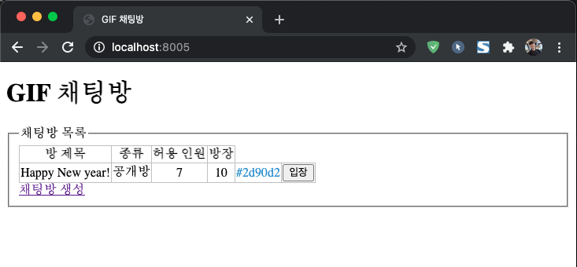
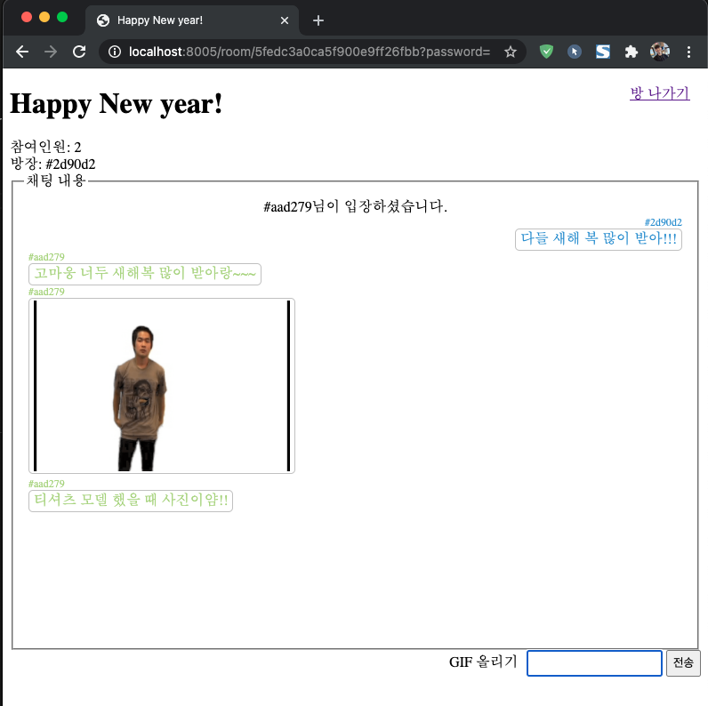

# 실시간 채팅 앱

웹 소켓은 HTML5에 새로 추가된 스펙으로 실시간 양방향 데이터 전송을 위한 기술이며, HTTP와 다르게 WS라는 프로토콜을 사용한다.

웹소켓이 나오기 전에는 HTTP 기술을 사용하여 실시간 데이터 전송을 구현했다.
그 중 한 가지가 Polling이라는 기술인데, 주기적으로 클라이언트에서 서버로 새로운 업데이트가 있는지 확인하는 요청을 보내고,
새로운 내용이 있다면 서버가 새로운 내용을 응답해주는 그런 단순 무식한 방법이었다.

하지만 웹 소켓을 이용하면, 처음에 웹 소켓이 연결된 이후에는 계속 연결된 상태로 있기 때문에
업데이트할 내용이 생겼다면, 서버에서 바로 클라이언트에게 알려줄 수 있다.

보통 WebSocket을 wrapping한 Socket.IO 모듈을 이용한다.
Socket.IO에서는 /room, /chat 같은 네임스페이스를 부여해서 같은 네임스페이스끼리만 데이터를 전달한다.

네임 스페이스보다 더 세부적인 개념으로 방(room)이 있다. 방(room)을 이용하면 같은 네임스페이스 안에서도 같은 방(room)에 들어있는 소켓끼리만 데이터를 주고 받을 수 있는 것이다.

실행 명령어  
$ npm install  
$ node app.js  

  
