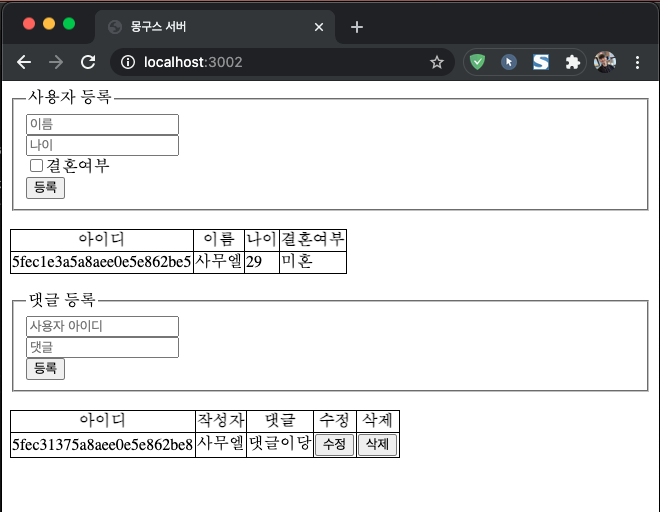

# mongoDB로 사용자 등록, 댓글 등록 구현하기

mongoDB는 NoSQL 데이터베이스의 대표주자다.
mongoDB는 자바스크립트 문법을 사용하는데, 서버에서 Node.js, DB에서 mongoDB를 이용하면, 자바스크립트만으로 웹 관련된 모든 걸 다 해결하는 것이다.

mongoose: MySQL의 시퀄라이즈처럼 mongoDB를 쓰기 편하게 wrapping한 모듈이다.

mongoDB를 설치하고 환경 설정하는 부분
$ mongo  
$ use admin 
$ db.create({user: 'root', pwd: 'rntmfoq', roles: ['root']})
$ vi /usr/local/etc/mongod.conf 에 아래 부분을 추가해야한다. (이건 맥북 기준)
"    security:
        authorization: enabled    "

실행 명령어  
$ npm install
$ node app.js

