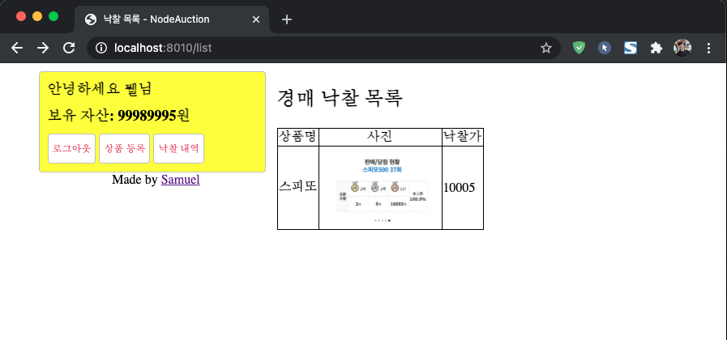

# 경매 시스템

온라인 경매는 모든 사람이 같은 시간에 경매가 종료되어야한다. 하지만 클라이언트의 시간은 제각각이므로 믿을 수 없으므로 서버에서 시간을 보내줘야한다.
이를 위해 서버센트 이벤트를 이용한다.

경매를 입찰하는 부분은 웹소켓을 이용한다.

우선 MySQL을 설치해야한다. 그리고 MySQL config 정보를 /config/config.json에 입력한다.

실행 명령어  
$ npm i  
$ npm sequelize init  
$ node app.js  

  
  
  