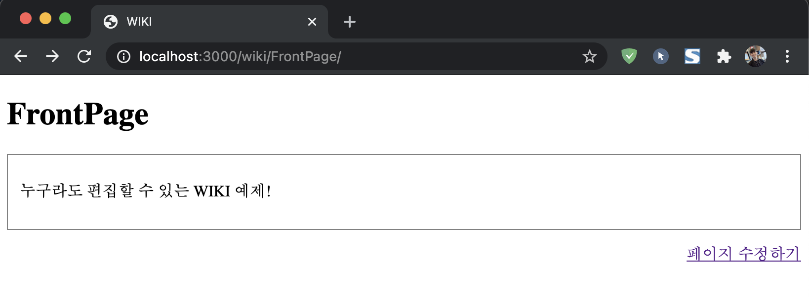
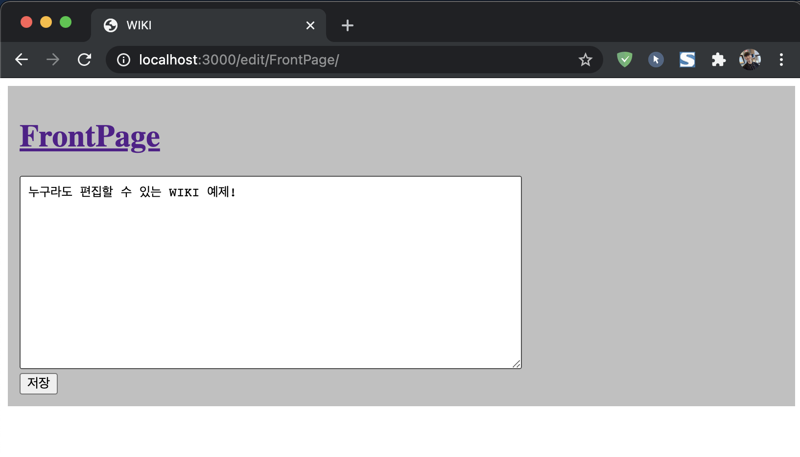

# 간단한 WIKI 시스템

클라이언트는 리액트로, 서버는 익스프레스로 구현함.
클라이언트와 서버는 필요에 따라 API를 통해 비동기 통신(Ajax)을 수행함.

리액트로 만든 위키 클라이언트는 출력 화면과 편집 화면을 가지며, 리액트 라우터를 활용해 페이지를 변경한다.
위키 서버는 NeDB에 위키 텍스트 데이터를 저장하고, API를 통해 데이터를 참조, 추가, 수정 기능을 제공한다.

실행 명령어  
$ npm install  
$ npm run build:parser    // 웹팩 모듈을 이용해서 /src/index.js 를 /public/bundle.js 로 변환한다!  
$ npm start  

